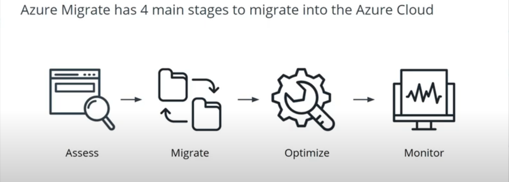

# Azure_Lessons

_A README file to help document my Azure services knowledge and lessons._

## Lesson 2: Azure cloud capabilities.

### New Terms:

    	VM - An Emulation of a computing system that uses software instead of Physical systems to run apps/SW.
    	DB_Server - Uses database application to provide Database services to Web applications, Web servers or other services.
    	Email- servers - Used for handling delivery of email through a network with an email software.

#### How to create a web server:

    	1 Login to the Azure portal.
    	2 Go to Services and select Viretual machines.
    	3 Provide required information.
    	4 Optional information.
    	5 Review + create.
    		Created VM for Test
    			Name: {Unique name for the VM}
    			Username: {Enter unique username}
    			password:{Enter a secure password}

### Azure HA Details:

    	1 Avalablity Zones - (Unique physical locations within Azure Cloud. Each can contain more than one physical data center.)
    	2 Vm Scale Sets.
    	3 Availablity Sets.
    		Fault domains.
    		Update domains.

### Load balancing:

    	1 Application Gateway.
    	2 Front door.
    	3 Azure Load balancer.
    	4 Taffic manager.

#### How to create LoadBalancer:

    		1	Search for Load Balancer and create a load balancer.
    		2	For the load balancer here are the unique properties
    		3	Resource group create a new one called Websiteloadbalancer
    		4	Instance: weblb
    		5	Public IP address: Create new and use the name loadbalancerIP = (196.168.16.8)
    		6	IP Address Assignment: Static
    		7	IPV6: No
    		8	Availability zone: Zone-redundant

    			Web Server 1:
    				Virtual machine name: webAdmin
    				Password: webAdmin345!
    				Another Password: loginAdmin1!

    			Web Server 2:
    				Virtual machine name: webAdmin2
    				Password: webAdmin345!

    			Public IP address of the LoadBalancer:52.236.152.46

### Azure APP Service: Just an HTTP service in azure for hosting applications.

#### Creating a DNN Web APP service:

    		1	Login to the Portal and obtain credentials from the file labeled AzureCreds.
    		2	In the Azure Portal, search and select for DNN Platform and fill out the fields as follows:
    				App name: DNN(yourLastName)
    					This has to be unique so if (yourLastName) is common you may need to add additional letters or numbers to make it unique
    				Resource Group: Select an existing option or create a new one.
    				Go to SQL Database Configure required settings and Name: DNNDB
    				Go to Target server Configure required settings and enter the following:
    					Server name: DNNdamilare
    						Just like the App name this needs to be unique
    					Server admin login: DNNadmin
    				Password: Meets the password complexity requirements (dnndamilare#3)
    				Select Allow Azure services to access server.
    				Select Priceng tier.
    		3	Deploy the resources.
    		4	Click on Notifications (top right of the page as a bell icon) to see the resources through the Go to resource button.
    		5	Click through the URL in the Overview section to open the site as an installation page. (May take some time to load.) Fill out the page as follows:
    				Username: host
    				Database Information:
    					Database Type: SQL Server/SQL server express database.
    					Server name: format of DNN(yourLastName).database.windows.net
    						This will be the server name that you entered when you entered in the target server section(.database.windows.net)
    					Database Name: DNNDB (or same as Step 2 on SQL Database)
    					Security: User Defined
    					Database Username: dnnadmin (or same as Step 2 on Target Server)
    					Database Password: same as Step 2 on Target Server
    					Run Database As: Select Database Owner.
    		6	Wait for the new installation dialogue box to complete.
    		7	Click on Visit Website and login
    		8 	Click on Visit Website and login
    		9	You will see the back end portal for DNN if at the top right you are logged in as Superuser Account.

    Service level agreements. (Aggrement between the data center and the consumers regarding uptime and allowed downtime).

## Creating VPN Gateway.

Creating a VPN gateway which is needed in order to province connectivity between and on-premise environment and resources within Azure. This is useful in situations that you have Azure resources that you do not want to be accessible on the general Internet.

#### How to create a VPN Gateway

1. Use the Navigation Pane on the top left to navigate to the Virtual networks to create a new virtual network.
2. Select an existing resource group from the dropdown.
3. For the instance details:
   -  Name: {Enter a unique name}.
4. In IP Addresses there should be no conflict with the default but if you are using a pre-existing Azure account with already established networks you may run into conflicts.

   -  IPv4 address space: 10.0.0.0/16.
   -  Subnet name: default.
   -  Subnet address range: 10.0.0.0/24.

5. In Security, you will want the default settings with all the options (Bastion Host, DDoS Protection Standard, and Firewall) being Disabled.
6. Finish creating the virtual network.
7. Navigate to Virtual network gateways to click on Create virtual network gateway with the following values:
   -  Name:{Unique name}
   -  Region: Same region used for virtual network.
   -  Gateway type: VPN.
   -  SKU: {Unique name}.
   -  Generation: {Select generation of choice}.
   -  Gateway subnet address range: 10.0.255.0/27 same settings shown in Step 4.
   -  Virtual network: same as step 3.
   -  Gateway subnet address range:10.0.1.0/24.
8. For Public IP address.
   -  Select Create new.
   -  Public IP address name: vpnGW1IP
   -  Public IP address SKU: Basic.
   -  Enable Active-active mode: Disabled.
   -  Configure BGP: Disabled.
9. Finish creating the Virtual network gateway. This process can take 30-45 minutes for deployment.
10.   Access Notificaions to click on Go to resource.
11.   Notice in the Overview section that the IP address is the same as in Step 8.

### Net Security group (NSG)

It's a basic cloud based firewall. However, it won't have all the features of a traditional firewall. It's mostly a basic functionality to restrict access to given resource.

#### Use NSGs on these areas to limit exposure:

-  Securing traffic flow between:
   -  Applications to internet.
   -  Applications to applications.
   -  Applications to users.

#### Tools to create NSGs

-  Azure portal.
-  Powershell / Linux terminal.
-  Azure CLI.

#### Steps to create NSG (Using Azure portal)

1. Create NSG:
   -  Login to Azure portal.
   -  Go to Networking → Network security group.
   -  Go into basics tab and define prameters(Subcription, Resource group, Name, Region).
   -  Finally, review and create.
2. Create Security rule.
   -  Within the Axure portal, go to NSG and select the NSG you need to modify.
   -  In the NSG menu bar go to inbound security rules or outbound security rules.
   -  Add values for the diffren applicable sections (Source, Source IP, Ports, destinations ...).
   -  Review and create.

### Use NSG to open ports for FTP service.

1. In the Azure Portal navigate to Virtual Machine and create VM.
2. Enable IIS and FTP server from server manager.
3. Open IIS manaer.
   -  Navigate to connections and right-click on the web service to expand its menu.
   -  Right-click on sites and select Add FTP Site ... with the following properties:
   -  FTP Site name:{Enter desired site name}
   -  Physical path: {Path to file to be shared}
4. Binding and SSL settings:
   -  IP address: All unassigned.
   -  Port: 21.
   -  Select start FTP site automatically.
   -  SSL: Require SSL.
   -  SSL certificate: Tenant encryptioncert.
5. Authentication and Authorization info:
   -  Authentication: Basic.
   -  Allow access to: All users.
   -  Permissions: Select both Read and Write.
6. Click finish.

Now at this point you may be able to connect to FTP server from the Virtual Machine, but not from the outside. If you type cmd in the Windows search box and type telnet localhost 21 you should get a response. So, now we need to proceed to configure server for outside access by modifing the internal firewall as well as the Azure NSG rules.

1. Navaigate to service and select FTP firewall support.
2. Under Actions on the right, select Open Feature.
3. In FTP Firewall Support for Data Channel Port Range set it to 5000-6000 and click Apply on the right. You will get prompted to configure firewall to allow FTP access for both the control channel and data channel port range.
4. Navigate to Windows Defender Firewall with Advanced Security.
5. Click on Inbound rules and select New rule.
6. Go through the Rule's Wizard, select port and continue.
   -  Select specific local ports and put 21, 5000-600 and continue.
   -  Select Allow the connection and continue.
   -  For When does this rule apply keep the checkbox selected for all three (Domain, Private, Public).
   -  Name: FTPservice.
   -  Click finish.
7. Return to IIS Manager and highlight myftpsite. Select FTP Firewall Support and on the right, click on open feature.
   -  Data Channel port range is already configured in a previous step and is not editable in this section.
   -  External IP address of Firewall enter the public IP address for your VM.
      The public IP address of your Virtual Machine may have changed from when you initially deployed.
8. Click on Apply to process the changes.
9. Restart the FTP service. This is a best practice for anytime you make changes. Open your CMD and:
   -  Type net stop ftpsvc to stop the FTP service (CMD).
   -  Type net start ftpsvc to restart the FTP service.
10.   Return to the Azure Portal to modify the NSG rule. The NSG was automatically created when we created the virtual machine, we now just need to add an inbound rule. Azure Portal>Virtual Machines>VM deployed>Settings>Networking.
      -  Click on Add inbound port rule.
      -  Destination port: 21, 5000-6000.
      -  Rule name: FTPservices. - All other entries can remain as default.

You will see a warning about port 5432 being exposed. This is not a production server and database services are not installed, so you can disregard and click Add.
Now you should be able to connect to the server through FTP services from the outside. You can either test from telnet from outside the server or if you have an FTP program(i.e. zilezilla, cute FTP, etc.) you should be able to connect using the Azure Public IP address of the virtual machine as the host, iisadmin as the FTP username and the RDP password for iisadmin for the FTP password.

## Lesson 3: Designing for backup and recovery.

#### Creating backup for virtuall machines.

1. From Azure portal go to virtual machines and select target VM.
2. Click on Operations and click on Backup.
3. Create and new Recovery Services vault:
   -  Give desired name.
   -  Notice the BackUp Frequency is daily at a specific time. This can be modified in the backup policy.
4. Enable Backup, this may take some time.
5. Manually run the backup by going to Virtual Machines>{Your VM}}>Operations>Backup and select Backup now.
6. Leave the Retain Backup Till as the defaukt and continue.

#### Create a new recovery servicea vault for a load balanced web server.

1. From Azure portal nevigat to recovery Services vaults and click New.
2. These will be the properties for the Recovery Service vault, then click through to create.
3. Once the deployment is completed, go to resource.
4. In getting started click on Backup and here are the properties.
   -  Where is your workload running?: Azure.
   -  What do you want to backup?: Virtual Machine.
   -  Click Backup to complete.
5. Use an existing Backup Policy and click Add.
6. Confirm that you see both virtual machines for the load balancer.
   -  If you do not then this means that the Recovery Services vault is in a diffrent Region then the virtuak machines. To fix that:
      -  Find the location of the VM.
      -  Create a new Recovery services vault in that location.
7. Finish creating the vault.

#### Managing Backup Policy.

1. Navigate to the Web loadbalancers Recovery Services Vault. Manage and click Backup Policies.
2. Click on DefultPolicy.
3. Click on modify with the following properties:
   -  Seet the Time to 30min - 1 Hour after you create the Policy.
   -  Timezone: Set it to your local time Zone.
4. At the top, click Save.

#### Restore a VM from Backup.

Create a Storage account.

1. From Azure portal and search for Stroge accounts.
2. Click stroge account and enter the properties below:
   -  Resource group: Slect desired resource group or create a new one.
   -  Stroage account name: {Enter desired account name}
   -  Region: Same as the VM region.
   -  Performance: standard.
   -  Account kind: Stroage V2 (gneral purpose).
   -  Replication: Locally redundant storage.
3. Finish creating the stroage account.

#### Shutting Down VM to be Restored.

1. In the Azure portal go to Webserverbackups resource group and select web01vault.
2. Under Protected items select Backup items.
3. Under BACKUP MANAGEMENT TYPE, click on Azure Virtual Machine.
4. Confirm that the backup has already completed by looking un Latest restore point.
5. Click on the 3 dots on the far right to access the context menu and click Restore VM.
6. In the Restore Virtual Machine, under the field for Restore pointclick on Select.
7. In Select restore point, you should see at least one restore point and select the most recent restore point and click OK to select the restore point.
8. Returning to the Restore Virtual Machine you will have these options:
   -  Restore configuration: Replace existing.
   -  Staging location: Select the already created storage account.
9. Finish the restoe by clicking Restore.
10.   Check the progress of the restore by going to the {Target VM}>Monitoring>Backup Jobs. There is a backup running as well because Azure Backup takes a snapshot of the VM before replacing the disk.
11.   Refresh periodically for the status to update.
12.   After the Virtual Machine is successfully restored you should be able to start it and login.

## Lesson 4: Azure Migration

The four main stahes to migrate onpremise services into Azure cloud.

#### Assess stage:

This is where we:

-  Identify servers, apps and resources to be migrated.
-  Make invertory of on-premises computing resources and dependencies.
-  Develop a map of how all the piecies of the application communicate.
-  Done with service MAP.
-  Best Migration Option for the Scenario:
   -  Rehost - Minimal.
   -  Refactor - Optimaztion.
   -  Rearchitect - Significant changes.
   -  Rebuild - from the ground up.
   -  Replace - Alternative.

#### Create a VM with SQL

1. From Azure portal find SQL virtual machines.
2. Click Create SQL virtual machines.
3. For image, {Select desired verion}:
   -  Resource group: Select desired or create new one.
   -  Create a new server and give it desired names.
   -  Virtual machine name: {Enter desired name}
   -  Region: {Select desired region}.
   -  Availibility options: No infrastructure redundancy required.
   -  Image: default.
   -  Size: {Select desired size.}
   -  Username: {Enter desired username}.
   -  Password: {Enter desired password}.
   -  Public inbound ports: Allow selected ports.
   -  Select inbound ports: RDP (3389).
   -  Do not click check box for use existing license.
4. Navigate to SQL server settings:
   -  SQL Authentication: Enable.
   -  Login name: {Enter login name}.
   -  Password: (meets the requirments).
   -  SQL Server License: No
   -  Auutomated backup: enable
   -  SQL Server Machine Learning Services (In-Database): Disable.
5. Finish deployment the SQL VM, which may take some time so go to the next step.
6. Download the sample database from Microsofts Azure Adventure Works to your local computer.
7. Once Step 5 is deployed, click on Go to resource.
8. Click on Connect>RDP and click Download RDP File.
9. Copy the AdventureWorksLT2019.bak file into the Temporary Storage drive.
10.   Connect to the VM and login with the username and password you created in Step 3.
11.   On your local machine search and navigate to Microsoft SQL Server Management Studio ## and click Connect.
12.   In the window, enter the following settings:
      -  Server type: Database engine.
      -  Server name: {Same as step 3}.
      -  Authentication: SQL server Authentication.
      -  Login and password: {Same as step 4}.
13.   Click connect.
14.   Right click on Databases and select Restore database....
15.   Click on the circle/radio button to the left of Device.
16.   Click on the 3 dots to the right of Device and the field.
17.   In the new window click Add and navigate and select the AdventureWorksLT2019.bak.
18.   Follow the setup leaving everything as default until you get the following message: Database 'AdventureWorksLT2019' restored successfully.
